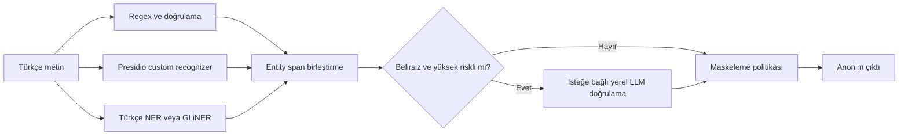

# Türkçe Hibrit Anonimleştirme PoC

Türkçe sigortacılık metinlerinde kişisel ve hassas veri span'larını tespit edip `<ENTITY>` biçiminde maskeleyen araştırma PoC'si. [Çalışma planı](PLAN.md), [karşılaştırma](docs/teknoloji-karsilastirmasi.md), [model incelemesi](docs/model-inceleme.md) ve [deney raporu](docs/deney-raporu.md) ayrı dosyalardadır.

## Mimari



Yerel LLM ikinci kontrolü isteğe bağlıdır ve yalnız `127.0.0.1:11434` Ollama sunucusuna bağlanır. Ollama/model bulunmayan ortamda gerçek LLM sonucu ölçülmemiştir. `rules` katmanı harici paket istemez. `presidio`, `ner` ve `gliner` seçimi ilgili paketlerin ve model ağırlıklarının ayrıca kurulmasını gerektirir. Algılama ile maskeleme ayrıdır; bir span'ın bulunması üretimde hangi politika kararının uygulanacağını tek başına belirlemez.

## Bu bilgisayarda çalıştırma

PowerShell açıp aşağıdaki komutları sırayla çalıştırın. `.venv` içinde Presidio, Türkçe NER ve GLiNER kütüphaneleri; `.model_cache` içinde iki modelin ağırlıkları hazırdır.

```powershell
Set-Location 'C:\path\to\proje'
$env:PYTHONPATH = (Join-Path (Get-Location) 'src')
$env:PYTHONIOENCODING = 'utf-8'
$env:HF_HOME = (Join-Path (Get-Location) '.model_cache')
$env:HF_HUB_OFFLINE = '1'

.\.venv\Scripts\python.exe -m hybrid_anon.cli --engines rules,presidio,ner,gliner --masker presidio "Ahmet Yılmaz'ın TC kimlik numarası 12345678901 ve plakası 34 ABC 123'tür."
.\.venv\Scripts\python.exe -m hybrid_anon.cli --engines rules,presidio,ner,gliner --evaluate data/synthetic_tr.jsonl
.\.venv\Scripts\python.exe scripts\benchmark.py --include-models
.\.venv\Scripts\python.exe -m unittest discover -s tests -v
```

İlk komut maskelenmiş metni ve bulunan alanların konumlarını gösterir. İkinci komut 17 sentetik örnekte seçilen katmanların sonucunu yazdırır. Üçüncü komut ölçümleri `docs/benchmark_results.json` dosyasına kaydeder. Dördüncü komut otomatik testleri çalıştırır. Yalnız kural katmanı için `--engines rules`, yalnız Presidio için `--engines presidio`, yalnız Türkçe NER için `--engines ner` seçilebilir.

Yeni bir bilgisayarda Python 3.12 sanal ortamı oluşturup `pip install -e '.[presidio,models]'` ile bağımlılıklar kurulabilir. Model ağırlıkları ayrıca indirilir; kurumsal ortamda önce onaylı dosyalar yerel depoya alınmalı ve `ANON_NER_MODEL` ile `ANON_GLINER_MODEL` yerel dizinlere yöneltilmelidir.

`HF_HOME` model önbelleğini proje içindeki `.model_cache` dizinine yönlendirir. `HF_HUB_OFFLINE=1` hazır NER ve GLiNER modellerinin ağ bağlantısı aramadan açılmasını sağlar. Yeni ağırlık indirmek gerektiğinde bu son değişkeni kaldırın. Önbellek sürüm kontrolü dışında tutulur.

`--masker presidio` seçeneği, birleştirilmiş span'ları Presidio Anonymizer'ın varsayılan `replace` operatörüne verir. Böylece tespit katmanı ile anonimleştirme katmanı ayrı ayrı denenebilir.

`scripts/benchmark.py` paket sürümlerini ve ölçümleri `docs/benchmark_results.json` dosyasına yazar; kurulu olmayan bileşenleri başarısız olarak kaydeder. `--include-models` bütün koşuları çalıştırır. Kurulu CPU PyTorch sürümü ekran kartını kullanmaz; GPU performansı bu PoC'ta ölçülmedi.

Yerel bir Ollama sunucusu ve onaylı model varsa `--local-llm-model MODEL_ADI` ile ikinci kontrol açılabilir. Bu kontrol yalnız risk işareti taşıyan metinlerde çalışır; modelin ürettiği konumlara güvenmez ve yalnız metinde tek kez birebir bulunan alıntıları kabul eder. Doğrulanmış kural tespitleri LLM kararıyla kaldırılmaz.

Örnek çıktıda son ek kaynak metinden korunur: `<VEHICLE_PLATE>'tür`. İstekteki `<VEHICLE_PLATE>'dir` biçimi, Türkçe ekin ayrıca yeniden üretilmesini gerektirir; PoC metni gereksiz yere değiştirmemek için bunu yapmaz. `12345678901` matematiksel olarak geçersiz TCKN'dir; yalnız açık “TC kimlik” bağlamı sayesinde maskelenir.

## Veri ve ölçüm

`data/synthetic_tr.jsonl` 17 sentetik metin ve karakter konumlu 23 altın etiket içerir. `data/build_dataset.py` konumları yeniden üretir. Değerlendirme aynı `start`, `end` ve `label` üçlüsünün tam eşleşmesini sayar. Bu veri geliştirme sırasında kullanıldığı için ölçülen skor genel Türkçe ya da üretim başarısını göstermez. Gerçekçi değerlendirme için ayrı, kurum onaylı ve elle etiketli kör test kümesi gerekir.

## Kısıtlar

- Ad ve adres kuralları yalnız dar bağlamları kapsar. Sağlık sözlüğü dolaylı anlatımları kaçırır ve genel tıbbi ifadeleri aşırı maskeleyebilir.
- Poliçe ve hasar numarası desenleri örnektir; kuruma ait formatlarla değiştirilmelidir.
- Çakışma çözümü sabit öncelik kullanır; model skorları farklı kaynaklar arasında kalibre edilmemiştir.
- Metin dışı belge, OCR, tablo ve görüntü redaksiyonu bu sürümde yoktur.
- CLI tespit konumlarını ve skorları yazdırır; ham entity değerlerini listelemez. Üretimde ham girdilerin loglanmaması ayrıca sağlanmalıdır.
